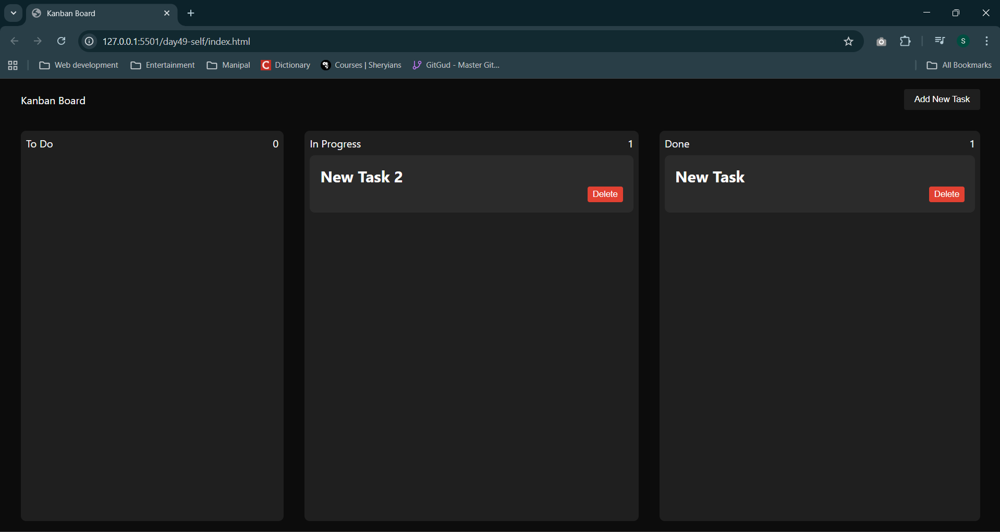

# Self Task: Created Kanban board 
- This task was based on a youtube tutorial by Sheryians Coding School
- The main aim for this exercise was to improve logic building with projects
- Here we tackled problems similarly by breaking it down to smaller parts.

## Task Completed Image

## Summary 
This was part 2 for building logic and we practiced with a lot of things. Though the code can be improved but the main objective was to build logic with some real world project.